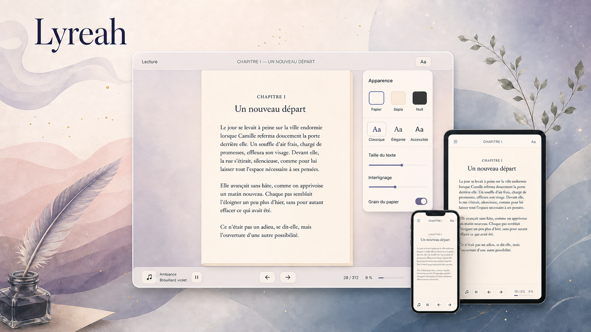

# Lyreah



> Une bibliothèque de classiques francophones où la lecture EPUB rencontre des
> ambiances sonores et visuelles entièrement optionnelles.

[](https://github.com/BastienAuT/Lyreah/actions/workflows/ci.yml)

Lyreah est une application web de lecture pensée comme un produit complet :
catalogue éditorialisé, liseuse responsive, progression synchronisée, réglages
d’accessibilité, bibliothèque personnelle et back-office de publication.

Le projet réunit actuellement **13 classiques en français** et propose jusqu’à
**11 ambiances** par lecture. Les œuvres, traductions, couvertures et pistes audio
conservent leurs informations de provenance et de licence.

## Ce que le projet démontre

- une expérience de lecture EPUB paginée sur ordinateur, mobile et tablette ;
- la reprise exacte grâce aux positions CFI synchronisées en base ;
- des thèmes papier, sépia et nuit, ainsi que le réglage de la police, de la
  taille, de l’interlignage et de la texture ;
- des paysages sonores multicouches avec volume, pause automatique et effets
  visuels facultatifs ;
- un catalogue filtrable, une bibliothèque personnelle et une authentification
  par compte ;
- un back-office sécurisé pour importer, contrôler et publier les EPUB et leurs
  ambiances ;
- une chaîne de traitement qui refuse les archives dangereuses, surdimensionnées
  ou faussement déclarées en français ;
- des métadonnées SEO, images sociales, pages légales, sitemap, robots.txt et
  sondes de santé prêts pour une mise en production.

## Architecture

```text
Navigateur
   │
   ├── Next.js App Router ── Neon Auth
   │          │
   │          ├── Drizzle ORM ── Neon PostgreSQL
   │          │
   │          └── API serveur ── Supabase Storage privé
   │                                  ├── EPUB maîtres
   │                                  ├── renditions contrôlées
   │                                  ├── couvertures
   │                                  └── ambiances audio
   │
   └── epub.js ── lecture, pagination et progression CFI
```

Les fichiers ne sont jamais rendus publics directement. Le serveur vérifie la
session et l’état de publication avant d’émettre des URL signées de courte durée.
La clé Supabase `service_role` reste exclusivement côté serveur.

## Stack technique

| Couche | Technologies |
|---|---|
| Interface | Next.js 16, React 19, TypeScript, CSS Modules et CSS natif |
| Lecture | epub.js, préférences locales et progression CFI synchronisée |
| Données | Neon PostgreSQL, Drizzle ORM et migrations versionnées |
| Authentification | Neon Auth |
| Fichiers | Supabase Storage privé et URL signées |
| Qualité | Bun Test, ESLint, TypeScript, Playwright et axe-core |
| Livraison | GitHub Actions, Vercel ou image Docker standalone |

## Sécurité et qualité éditoriale

L’import EPUB applique plusieurs barrières avant publication : validation du
format, contrôle des chemins, CRC, plafond de 2 000 fichiers, limites de taille
compressée et extraite, vérification de la structure EPUB et validation réelle
de la langue française. Le contenu scripté reste désactivé dans la liseuse.

Les routes d’administration revérifient systématiquement la session et le rôle
`admin`. Le bucket de stockage est privé et séparé par environnement. Les réponses
contenant des URL signées ou des données personnelles utilisent `private,
no-store`.

Le détail de la provenance des œuvres est disponible dans
[docs/editorial-qa.md](docs/editorial-qa.md). Le bilan de préparation portfolio se
trouve dans [docs/audit-portfolio-2026-08-24.md](docs/audit-portfolio-2026-08-24.md).

## Démarrage local

Prérequis : [Bun 1.3+](https://bun.sh/), une base Neon et un projet Supabase.

```bash
git clone git@github.com:BastienAuT/Lyreah.git
cd Lyreah
bun install
cp .env.example .env.local
```

Renseigner les variables de `.env.local`, puis préparer la base et le stockage :

```bash
bun run db:migrate
bun run storage:setup
bun run db:seed
bun run services:check
bun dev
```

L’application est disponible sur <http://localhost:3000>.

## Commandes utiles

```bash
bun run test          # tests unitaires
bun run lint          # règles ESLint et accessibilité statique
bun run typecheck     # validation TypeScript
bun run build         # build Next.js de production
bun run test:e2e      # parcours Playwright desktop, mobile et tablette
bun run catalog:audit # contrôle éditorial sans import
```

## Mise en production

Le dépôt inclut une CI GitHub Actions, un `Dockerfile` multi-stage, une
configuration Vercel Paris (`cdg1`), une sonde `/api/health` et un plan de
sauvegarde/restauration. La procédure complète est documentée dans
[docs/production-runbook.md](docs/production-runbook.md).

Avant l’ouverture publique, il reste à définir l’URL canonique de production,
compléter les variables d’identité légale et rejouer la suite E2E authentifiée
contre un environnement de staging dédié.

## Crédits

Les textes du catalogue sont issus du domaine public ou de sources compatibles
dont les crédits sont affichés sur chaque fiche. Les ambiances utilisent des
sources CC0 ou du domaine public référencées dans le back-office. Le visuel de
présentation a été créé spécifiquement pour Lyreah avec OpenAI ImageGen.
